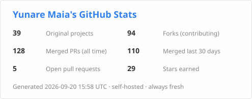
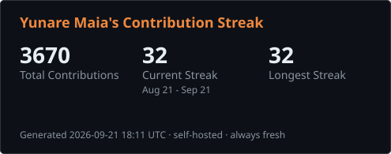

# Yunare Maia 🇧🇷

Open-source developer from Mossoró, Rio Grande do Norte - Brazil. I contribute
to agent runtimes and AI infrastructure: provider error classification, retry
UX, tool schemas, test-suite migrations and the CI hygiene that keeps big
repos mergeable. Steady, reproducible, reviewed - one focused PR at a time.

## Now

- **[apache/maka](https://github.com/apache/maka)** (agent runtime, ASF) -
  permission-mode refactor, usage-limit billing paths, humanized retry delays,
  model capability metadata and desktop flake fixes.
- **In flight:** [open pull requests](https://github.com/search?q=author%3Ayunaremaia+is%3Apr+is%3Aopen&type=pullrequests)
  across agent runtimes and open-data curation - including sandbox Grep
  argument handling and vision-model capability metadata.
- **Recently merged:** [live search](https://github.com/search?q=author%3Ayunaremaia+is%3Apr+is%3Amerged&type=pullrequests)
  | highlights below.

## What I work on

- 🤖 **Agent runtimes & LLM tooling** - provider billing/error taxonomies,
  retry UX, MCP tool schemas, capability systems (TypeScript)
- 🔬 **Test infrastructure & CI hygiene** - flake elimination, conformance
  vectors, reproducible pipelines (Rust, Python, Mojo)
- 📊 **Open data** - schema-validated vendor/startup program datasets

## Recent merged work

<!-- yunare-dynamic:start -->
| When | Where | What |
|------|-------|------|
| 2026-08-25 | [apache/maka](https://github.com/apache/maka) | [fix(core): include 'low' effort for deepseek-v4-flash](https://github.com/apache/maka/pull/3732) *(+4 more)* |
| 2026-08-17 | [decionis/agent-safe-pipeline](https://github.com/decionis/agent-safe-pipeline) | [docs: cryptographic agility and TLS verification posture (closes #51)](https://github.com/decionis/agent-safe-pipeline/pull/56) *(+2 more)* |
| 2026-08-17 | [cactus-compute/needle](https://github.com/cactus-compute/needle) | [feat: add type hints to public API (closes #73)](https://github.com/cactus-compute/needle/pull/74) |
| 2026-08-16 | [fellowgeek/mcp-memory](https://github.com/fellowgeek/mcp-memory) | [fix: contain memory keys inside the store (path traversal)](https://github.com/fellowgeek/mcp-memory/pull/3) |
| 2026-08-14 | [addyosmani/agent-skills](https://github.com/addyosmani/agent-skills) | [docs(antigravity): correct plugin install path](https://github.com/addyosmani/agent-skills/pull/481) |
| 2026-08-14 | [semantica-agi/semantica](https://github.com/semantica-agi/semantica) | [ci: pin Python dependencies in requirements-ci.txt for reproducible CI](https://github.com/semantica-agi/semantica/pull/945) *(+2 more)* |
<!-- yunare-dynamic:end -->

## Stack

`TypeScript` `Python` `Rust` `Mojo` `Bash` · Node · git-first workflows ·
schema-driven pipelines · distributed test runners

## Support

If my open-source work saves you time, you can support it here:

- **Solana / cbBTC:** `Eeztv1nCYUt1fwGWpzKC948gaWfjejYCAuLtUMgzDWbW`
- Or collaborate: pick an [open issue](https://github.com/search?q=author%3Ayunaremaia+is%3Aissue+is%3Aopen&type=issues) I maintain, or ping me below.

## Reach me

- GitHub issues and PRs are the fastest channel
- Email: [yunare@gmail.com](mailto:yunare@gmail.com)

---

*Profile refreshed daily by an automation I maintain - tables and stat cards
pulled live from the GitHub API on each run.*
