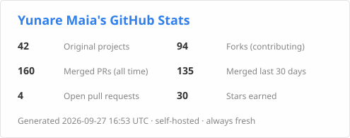
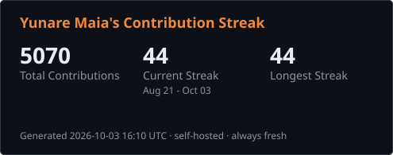

# Yunare Maia 🇧🇷

Open-source developer from Mossoró, Rio Grande do Norte - Brazil. I build
**driftcheck** — a CLI that catches version drift between docs and toolchain
files before your contributors hit a build failure. I also contribute to agent
runtimes, security scanners, and developer tooling: AI-policy classification,
vulnerability reporting, CLI ergonomics, and the CI hygiene that keeps big repos
mergeable. Steady, reproducible, reviewed — one focused PR at a time.

## Now

- **Open PRs:** [open pull requests](https://github.com/search?q=author%3Ayunaremaia+is%3Apr+is%3Aopen&type=pullrequests) across
  developer tooling, security scanners, and upstream reproducibility. Currently in flight:
  - `ray-project/kuberay#5286` — remove unused DecompressStream to clear gosec G110
  - `yunaremaia/context-bridge#109` — add Python 3.13 to the test matrix
- **Recently merged:** [browse the live search](https://github.com/search?q=author%3Ayunaremaia+is%3Apr+is%3Amerged&type=pullrequests)
  or see the highlights below.

## Featured contributions

- 🔍 **[yunaremaia/driftcheck](https://github.com/yunaremaia/driftcheck)** — my own project.
  Detects version drift between docs and toolchain files (README vs Dockerfile,
  build.gradle, pom.xml, versions.tf, .circleci/config.yml, .gitlab-ci.yml,
  GitHub Actions versions, Kubernetes manifests, Helm charts, Taskfiles, and more).
  86 detector modules, 1516 tests, 25+ drift types.
- 🛡️ **[yunaremaia/aipr](https://github.com/yunaremaia/aipr)** — AI-policy pre-screening
  for contributors: classifies CONTRIBUTING/AI_POLICY/AGENTS docs and flags repos that
  require human-in-the-loop disclosure before you invest hours building a PR.
- ⚡ **[yunaremaia/agentcost](https://github.com/yunaremaia/agentcost)** — track and
  compare LLM API pricing across 20+ models with SQLite persistence for historical
  cost analysis.
- 🏛️ **[apache/maka](https://github.com/apache/maka)** (ASF agent runtime) - five
  merged PRs in one week: [permission-mode refactor](https://github.com/apache/maka/pull/3603),
  [usage-limit billing paths](https://github.com/apache/maka/pull/3660),
  [humanized retry delays](https://github.com/apache/maka/pull/3611),
  [DeepSeek V4 Flash metadata](https://github.com/apache/maka/pull/3732), and a
  [desktop flake fix](https://github.com/apache/maka/pull/3737).
- 📦 **[anchore/syft](https://github.com/anchore/syft)** — Syft is the open-source
  SBOM generator. Contributed PURL generation fixes for GitHub Actions packages
  (skip docker:// references to prevent malformed package URLs).
- 🔐 **[decionis/agent-safe-pipeline](https://github.com/decionis/agent-safe-pipeline)** -
  cryptographic-agility docs, TLS verification posture, and Unicode edge-case
  conformance vectors ([#56](https://github.com/decionis/agent-safe-pipeline/pull/56),
  [#55](https://github.com/decionis/agent-safe-pipeline/pull/55),
  [#23](https://github.com/decionis/agent-safe-pipeline/pull/23)).
- 🧠 **[LMCache/LMCache](https://github.com/LMCache/LMCache)** — KV-cache
  acceleration for LLM inference. Lint hygiene pass removing stale `gosec`
  suppresses now that connector adapters are clean.

## What I work on

- 🔍 **Drift detection** — version drift between docs and toolchain files
  (Dockerfile, build.gradle, pom.xml, versions.tf, CircleCI, GitLab CI,
  GitHub Actions, Kubernetes, Helm, Taskfiles, and more)
- 🤖 **AI policy tooling** — automated pre-screening of AI contribution policies
  so contributors know before building whether a repo accepts autonomous PRs
- 💰 **LLM cost tracking** — pricing APIs, historical cost analysis, model comparison
- 🔬 **Test infrastructure & CI hygiene** — flake elimination, conformance
  vectors, reproducible pipelines (Rust, Python, Mojo, Go, C++)
- 📦 **Software composition analysis** — SBOM generation, PURL correctness,
  vulnerability reporting
- 🔤 **Encoding & Unicode correctness** — UTF-8 sanitization, Windows code-page
  edge cases, `std::error_code` formatter robustness (C++)
- 🤖 **AI agent safety** — policy-as-code permissions (agent-guard), security
  scanning for AI-generated code (vibeguard), MCP server audits (mcp-guard),
  memory health monitoring (memwatch), CLI output filtering (leanpipe)
- 🔄 **Agent state & observability** — checkpoint/recovery (agent-checkpoint),
  session memory (context-bridge), token tracking (agentcost), worktree
  isolation (agent-workspace), tool-call rollback (agent-undo)

## Recent merged work

<!-- yunare-dynamic:start -->
| When | Where | What |
|------|-------|------|
| 2026-09-29 | [yunaremaia/driftcheck](https://github.com/yunaremaia/driftcheck) | [feat: detect Python target drift inside pyproject.toml tool tables](https://github.com/yunaremaia/driftcheck/pull/442) *(+9 more)* |
| 2026-09-27 | [yunaremaia/ci-test-gate](https://github.com/yunaremaia/ci-test-gate) | [ci: update github-script to v8 for Node 24 runner compatibility](https://github.com/yunaremaia/ci-test-gate/pull/92) |
| 2026-09-27 | [yunaremaia/agent-undo](https://github.com/yunaremaia/agent-undo) | [feat: add rollback simulation/dry-run mode with diff preview and command list (#](https://github.com/yunaremaia/agent-undo/pull/49) |
| 2026-09-27 | [yunaremaia/gfi](https://github.com/yunaremaia/gfi) | [feat: add persistent seen-issue tracking with URL-based dedup and deterministic ](https://github.com/yunaremaia/gfi/pull/59) *(+1 more)* |
| 2026-09-26 | [yunaremaia/agent-guard](https://github.com/yunaremaia/agent-guard) | [security: add path traversal protection to _normalize_path](https://github.com/yunaremaia/agent-guard/pull/153) |
| 2026-09-26 | [yunaremaia/aipr](https://github.com/yunaremaia/aipr) | [fix(ci): update GitHub Actions to known-stable versions](https://github.com/yunaremaia/aipr/pull/128) |
<!-- yunare-dynamic:end -->

## Stack

`TypeScript` `Python` `Rust` `Mojo` `C++` `Go` `Bash` · Node · git-first workflows ·
schema-driven pipelines · distributed test runners · drift detection ·
AI policy tooling · LLM cost tracking

## Support

If my open-source work saves you time, you can support it here:

- **Solana / cbBTC:** `Eeztv1nCYUt1fwGWpzKC948gaWfjejYCAuLtUMgzDWbW`
- Or collaborate: pick an [open issue](https://github.com/search?q=author%3Ayunaremaia+is%3Aissue+is%3Aopen&type=issues) I maintain, or ping me below.

---

## Featured Projects

| Project | What it does | Stack | Tests |
|---------|-------------|-------|-------|
| [driftcheck](https://github.com/yunaremaia/driftcheck) | 86 detectors for version drift between docs and toolchain files — Dockerfile, go.mod, rust-toolchain, package.json, Taskfile, Gradle, .NET/C#, Node 20→24 Actions, A2A protocol, and more. `--fix` mode + SARIF output | Python · pytest | 1453 |
| [taintrace](https://github.com/yunaremaia/taintrace) | Typosquat detector for package managers — catches malicious lookalike names before they reach your lockfile | Python · rapidfuzz | 116 |
| [agent-guard](https://github.com/yunaremaia/agent-guard) | Policy-as-code for AI agent permissions — define bounded permissions in YAML, enforce at runtime with shell injection, ReDoS, and symlink path-traversal prevention | Python · YAML | — |
| [agentcost](https://github.com/yunaremaia/agentcost) | Token usage tracker for multi-agent AI sessions — per-agent, per-run cost breakdowns with SQLite persistence | Python · SQLite | 64 |
| [depscan](https://github.com/yunaremaia/depscan) | Multi-ecosystem dependency scanner (PyPI, npm, Cargo, Go, PHP) with vulnerability and typosquat detection | Python | 13 |
| [ci-test-gate](https://github.com/yunaremaia/ci-test-gate) | LLM-powered test selection for CI — runs only tests relevant to the semantic diff, cutting CI minutes | Python | 157 |
| [diff-contract](https://github.com/yunaremaia/diff-contract) | Deterministic guardrails for AI-generated diffs — block changes to protected paths, enforce contract boundaries | Python | 59 |
| [aipr](https://github.com/yunaremaia/aipr) | AI contribution policy scanner for repositories — CI exit codes for humans and agents; detects AI policy gates pre-flight | Python | 37 |
| [vibeguard](https://github.com/yunaremaia/vibeguard) | Security scanner for AI-generated code — shell injection, ReDoS, symlink traversal detection | Python | — |
| [mcp-guard](https://github.com/yunaremaia/mcp-guard) | Security scanner for MCP servers — audit capabilities, detect risks, generate SARIF reports | Python | — |
| [agent-undo](https://github.com/yunaremaia/agent-undo) | Record and rollback AI agent operations — file writes, shell commands, git ops, API calls. Time-machine for AI agent actions | Python | — |
| [agent-checkpoint](https://github.com/yunaremaia/agent-checkpoint) | Crash recovery preserving exact AI agent state — decisions, reasoning log, accumulated context — with deterministic resume | Python | — |
| [agent-workspace](https://github.com/yunaremaia/agent-workspace) | Git worktree manager for parallel AI agents | Python | — |
| [context-bridge](https://github.com/yunaremaia/context-bridge) | Universal session memory for AI agents — capture, index, recall across any AI coding agent | Python | — |
| [leanpipe](https://github.com/yunaremaia/leanpipe) | CLI output filter for AI agents — strip noise, keep signal, save tokens | Python | — |
| [memwatch](https://github.com/yunaremaia/memwatch) | Agent Memory Health Monitor — scan AI agent memory stores for rot, contradictions, and duplicates | Python | — |
| [ghstats](https://github.com/yunaremaia/ghstats) | GitHub Stats Dashboard — visualize contributions, PRs, and activity from the terminal | Python | — |
| [gfi](https://github.com/yunaremaia/gfi) | Good First Issue finder — search and filter GitHub issues for contributors | Python | — |
| [a2a-drift](https://github.com/yunaremaia/a2a-drift) | Detect A2A (Agent2Agent) protocol compliance drift — agent cards, endpoints, spec versions, JSON-RPC conformance | Python | — |
| [agent-behavior-drift](https://github.com/yunaremaia/agent-behavior-drift) | Detect behavioral drift in AI agent sessions — tool-call patterns, output quality, decision anomalies | Python | — |
| [ci-sandbox](https://github.com/yunaremaia/ci-sandbox) | Local CI pipeline simulator — see what runs and what skips without executing anything | Python | — |
| [cli-shim](https://github.com/yunaremaia/cli-shim) | Universal Agent-Native CLI Adapter — makes legacy CLIs agent-friendly | Python | — |
| [mcp-reconcile](https://github.com/yunaremaia/mcp-reconcile) | Cross-tool MCP configuration drift detection and reconciliation | Python | — |
| [oss-contribution-finder](https://github.com/yunaremaia/oss-contribution-finder) | Find open-source contribution opportunities via GitHub API | Python | — |
| [agent-capability-attestation](https://github.com/yunaremaia/agent-capability-attestation) | Capability attestation for AI agents — verify declared capabilities against observed behavior | Python | — |
| [env-drift](https://github.com/yunaremaia/env-drift) | Environment variable drift detection — `.env` vs actual runtime config | Python | — |
| [prompt-drift](https://github.com/yunaremaia/prompt-drift) | Prompt template drift detection — detect changes in prompt chains across versions | Python | — |
| [proto-drift](https://github.com/yunaremaia/proto-drift) | Protobuf/gRPC schema drift detection — breaking changes in .proto files | Python | — |
| [license-drift](https://github.com/yunaremaia/license-drift) | License header drift detection — missing or stale SPDX headers in source files | Python | — |
| [dotfiles-drift](https://github.com/yunaremaia/dotfiles-drift) | Dotfiles configuration drift detection — sync dotfiles across machines | Python | — |
| [ci-gate-watch](https://github.com/yunaremaia/ci-gate-watch) | CI gate drift watch — detect when required CI checks change or disappear | Python | — |
| [mcp-response-guard](https://github.com/yunaremaia/mcp-response-guard) | MCP response guard — validate MCP server responses against declared schemas | Python | — |
| [agent-memory](https://github.com/yunaremaia/agent-memory) | Structured memory for AI agents — persistent key-value with TTL and namespaces | Python | — |
| [agent-call-graph](https://github.com/yunaremaia/agent-call-graph) | Call graph visualization for AI agent tool invocations | Python | — |
| [ai-reputation-guard](https://github.com/yunaremaia/ai-reputation-guard) | Reputation scoring for AI-generated contributions — detect low-effort patterns | Python | — |
| [tool-call-retry](https://github.com/yunaremaia/tool-call-retry) | Retry logic with backoff for AI agent tool calls | Python | — |
| [migrate-safe](https://github.com/yunaremaia/migrate-safe) | Safe migration runner for AI agent state across versions | Python | — |
| [org-policy-drift](https://github.com/yunaremaia/org-policy-drift) | Organization policy drift detection — enforce consistency across repos | Python | — |
| [acc-mcp](https://github.com/yunaremaia/acc-mcp) | MCP server for accessibility testing | Python | — |
| [sandbox-ffi-layers](https://github.com/yunaremaia/sandbox-ffi-layers) | FFI sandboxing layers for secure AI agent execution | Rust | — |
| [git-api](https://github.com/yunaremaia/git-api) | Git API wrapper for AI agents | Python | — |

---

## Focus Areas

- **Drift Detection** — version drift between documentation and actual toolchain files across 14+ ecosystems (Maven, Terraform, CircleCI, GitLab CI, GitHub Actions, Kubernetes, Helm, Docker Compose, Dependabot, .NET/C#, Taskfile, Gradle, pip, npm, Node 20→24 Actions migration, A2A protocol)
- **Dependency Security** — typosquat detection (taintrace), multi-ecosystem vulnerability scanning (depscan), supply-chain risk analysis, license drift detection
- **AI Agent Safety** — policy-as-code permissions with runtime enforcement (agent-guard), security scanning for AI-generated code (vibeguard), MCP server audits (mcp-guard), memory health monitoring (memwatch), CLI output filtering (leanpipe)
- **CI/CD Intelligence** — LLM-powered test selection (ci-test-gate), deterministic diff guardrails (diff-contract), AI policy gates for CI (aipr), local CI simulation (ci-sandbox), CI gate drift watch (ci-gate-watch)
- **Agent Observability & State** — token usage tracking (agentcost), universal CLI adapters (cli-shim), session memory bridging (context-bridge), crash recovery with state preservation (agent-checkpoint), worktree isolation (agent-workspace), tool-call rollback (agent-undo), behavioral drift detection (agent-behavior-drift), capability attestation (agent-capability-attestation)
- **Protocol & Standards Compliance** — A2A protocol drift detection (a2a-drift), MCP configuration reconciliation (mcp-reconcile), MCP response guard (mcp-response-guard), protobuf/gRPC drift (proto-drift)
- **Developer Experience** — good first issue finder (gfi), GitHub stats dashboard (ghstats), OSS contribution finder (oss-contribution-finder), prompt drift detection (prompt-drift), env drift detection (env-drift)

---

## Stats

| Metric | Value |
|--------|-------|
| Public repos | 138 |
| Original projects | 43 |
| Merged PRs | 169 |
| Total tests | 1750+ |
| Stars received | 29 |
| Followers | 57 |
| Current streak | see card below |
| Primary language | Python |

---

## Contribution Streak

  

---

## Upstream Contributions

Contributions to **apache/maka**, **modular/modular**, **sharkdp/bat**, **biopython/biopython**, **SeaQL/sea-orm**, **upscayl/upscayl**, **anchore/syft**, **LMCache/LMCache**, **karmada-io/karmada**, **ray-project/kuberay**, and several others. Focus on actionable fixes: version drift, docs sync, test improvements, and CI hardening.

---

## Toolchain

- **Python** (primary) — pytest, click, rich, rapidfuzz, SQLite
- **Rust** — FFI layers, sandboxing primitives, proc-macro security
- **GitHub API** — GraphQL + REST, Actions, CI integration
- **CLI-first** — every tool installable via `pip install git+https://...`, designed for scripting and automation

---

## Reach Me

- **GitHub issues and PRs** are the fastest channel for anything project-related
- **Email:** [yunare@gmail.com](mailto:yunare@gmail.com)
- **Operating agreement:** [inicio.md](https://github.com/yunaremaia/yunaremaia/blob/main/inicio.md) (public-facing identity and contributor rules)

---

## For Contributors

- All projects are **open source first** — PRs welcome in any repo above
- Check each repo's `CONTRIBUTING.md` and AI policy before contributing (use [aipr](https://github.com/yunaremaia/aipr) to auto-detect policy gates)
- Issues labeled `good first issue` are actively maintained — claim before opening a PR
- Public artifacts (PRs, commits, issues) are **English only**

---

*Bio and stats refreshed automatically by [github-profile-keeper](https://github.com/yunaremaia/yunaremaia) cron.*

